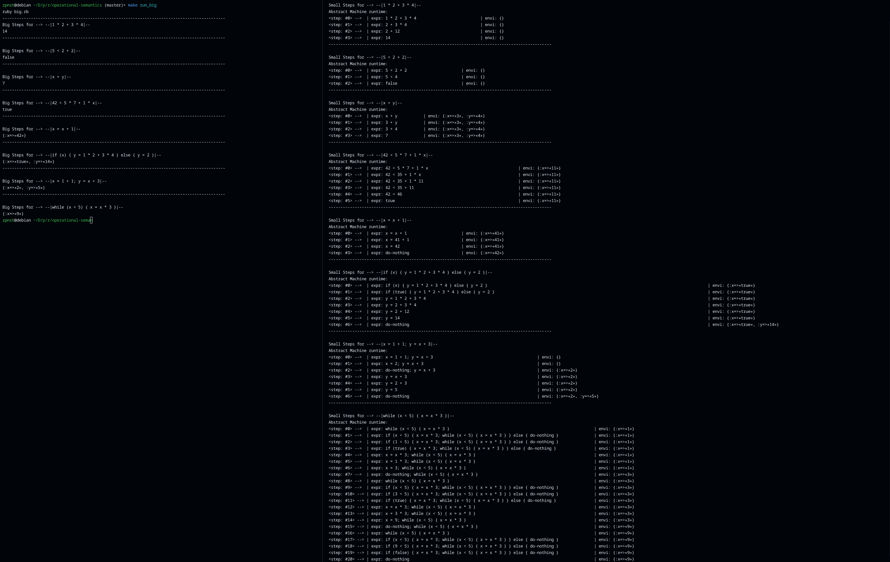

# Предисловие

Код программ был взят из книги, которая указана в конце в ссылках. В коде были исправлены ошибки(*так как по мере продвижения по примерам и изменения кода под них — предыдущие примеры работать переставали*) и он был переделан в более понятный и приятный вид. Также будут приведены некоторые цитаты из этой книги.

# Операционная семантика 

Семантика языка программирования — это смысл, стоящий за синтаксическими конструкциями, или, проще говоря, за программой.

Тут рассматривается именно операционная семантика. 

*Цитата из книги № 1*
```
Самый практически полезный способ рассуждать о смысле про-
граммы – задать вопрос «что она делает?»; что мы ожидаем получить
в результате запуска программы? Как различные конструкции языка
программирования ведут себя во время выполнения и что происходит,
когда мы объединяем их для получения более крупной программы?
```

Применив операционную семантику, мы можем строго и точно описать назначение различных конструкций языка. Существует два её вида — операционная семантика мелких шагов и операционная семантика крупных шагов.

### Операционная семантика мелких шагов

Операционная семантика мелких шагов направлена на определение правил исполнения или свёртывания программ на специфицируемом языке программирования. Под свёртыванием понимается уменьшение программы шаг за шагом, пока мы не дойдём до момента, когда свёртывать больше нечего. Можно сравнить этот процесс с накоплением в стеке рекурсивных вызовов и базой рекурсии.

Свёртывания эти выполняет некая абстрактная машина, она и описана в этом репозитории на языке Ruby. Обычно для языка программирования с названием “<(0_0)>” такая машина называется “<(0_0)> машина” .

*Цитата из книги № 2*
```
Мы только что видели, как устроена операционная семантика
мелких шагов: мы проектируем абстрактную машину, которая хра-
нит некоторое состояние выполнения, а затем определяем правила
свертки, которые говорят, каким образом каждая программная кон-
струкция может постепенно продвигаться к результату вычисления.
```
### Операционная семантика крупных шагов

Операционная семантика крупных шагов призвана объяснить то же самое, но сделать это в  более непосредственной форме, сразу описав, что происходит при выполнении программы. То есть при таком подходе мы шаг за шагом не свёртываем исходных код программы, а сразу говорим что он делает.

*Цитата из книги № 3*
```
Правила семантики крупных шагов описывают, как вы-
числить результат всей программы, обойдя его абстрактное синтак-
сическое дерево в один заход, поэтому ни состояния, ни повторения
не будет.
```

# Вывод программ 

Слева — вывод семантики крупных шагов, справа — мелких. Конечный результат идентичен, но в случае с малыми шагами мы подробно видим этапы вычисления, точнее даже свёртывания программы. Так как абстрактная машина в цикле переходит от состояния к состоянию пока есть что свёртывать. В случае же с крупными шагами как код, так и вывод получился намного короче, так как мы не нуждаемся в абстрактной машине и состояниях.



# Наблюдения

По сути, описывая операционную семантику языка программирования не в математической нотации, а на другом языке – мы получаем интерпретатор :) 

*Цитата из книги № 4*
```
От вашего внимания, наверное, не ускользнул тот факт, что при
записи семантики мелких и крупных шагов языка SIMPLE на Ruby
вместо математического формализма мы реализовали два разных
интерпретатора. Именно в этом и состоит существо операционной
семантики: объяснения смысла языка путем описания его интерпре-
татора.
```

# Запуск примеров

```bash
git clone git@github.com:zpnst/operational-semantics.git
cd operational-semantics
make run_big
make run_small
```
# Ссылки

1. [Теория вычислений для программистов, глава 2](https://ftp.zhirov.kz/books/IT/Other/%D0%A2%D0%B5%D1%80%D0%B8%D1%8F%20%D0%B2%D1%8B%D1%87%D0%B8%D1%81%D0%BB%D0%B5%D0%BD%D0%B8%D0%B9%20%D0%B4%D0%BB%D1%8F%20%D0%BF%D1%80%D0%BE%D0%B3%D1%80%D0%B0%D0%BC%D0%BC%D0%B8%D1%81%D1%82%D0%BE%D0%B2%20%28%D0%A2%D0%BE%D0%BC%20%D0%A1%D1%82%D1%8E%D0%B0%D1%80%D1%82%29.pdf)
2. [wikipedia(без шуток)](https://ru.wikipedia.org/wiki/%D0%A1%D0%B5%D0%BC%D0%B0%D0%BD%D1%82%D0%B8%D0%BA%D0%B0_(%D0%BF%D1%80%D0%BE%D0%B3%D1%80%D0%B0%D0%BC%D0%BC%D0%B8%D1%80%D0%BE%D0%B2%D0%B0%D0%BD%D0%B8%D0%B5))


